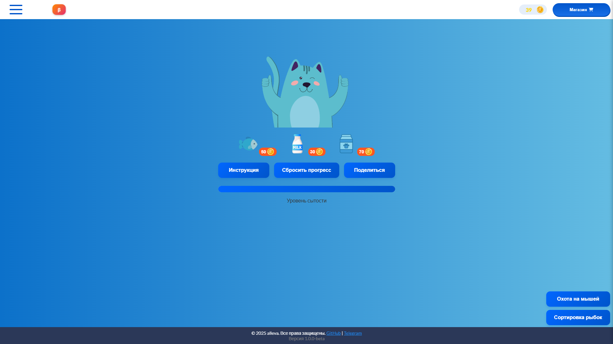

# Мой Мэшик

  
"Мой Мэшик" – это интерактивная браузерная игра, где вы заботитесь о виртуальном питомце - коте Мэшике из Московской электронной школы (МЭШ). Кормите его, играйте в мини-игры и улучшайте его жизнь. Игра доступна на [GitHub Pages](https://allevalion.github.io/my-meshik/).

## Особенности

- Система кормления и уровня сытости
- Магазин с различными предметами
- Две мини-игры: "Охота на мышей" и "Сортировка рыбок"
- Достижения (в разработке)
- Адаптивный дизайн для всех устройств
- Анимации и визуальные эффекты

## Технологии

- HTML5, CSS3, JavaScript
- GSAP для анимаций
- Адаптивный дизайн с медиа-запросами
- Локальное хранилище для сохранения прогресса

## Установка

1. Клонируйте репозиторий:
   ```bash
   git clone https://github.com/allevalion/my-meshik.git
   ```
2. Откройте файл `index.html` в браузере.

Или играйте онлайн на GitHub Pages.

## Планы по развитию

- Добавление новых мини-игр
- Расширение системы достижений
- Больше предметов в магазине
- Улучшение графики и анимаций
- Добавление социальных функций

## Отказ от ответственности

Автор данного проекта не имеет отношения к Московской электронной школе (МЭШ). Проект создан исключительно в образовательных и развлекательных целях. В случае возникновения претензий со стороны владельцев/правообладателей МЭШ, я готов удалить проект по их требованию.

Для связи: [Telegram](https://t.me/llukyanov)